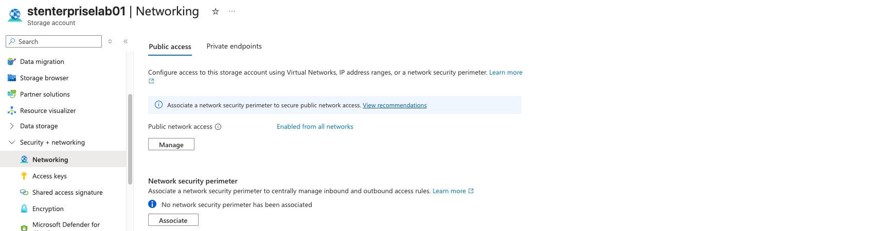
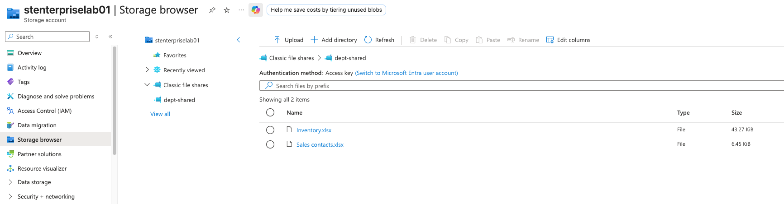
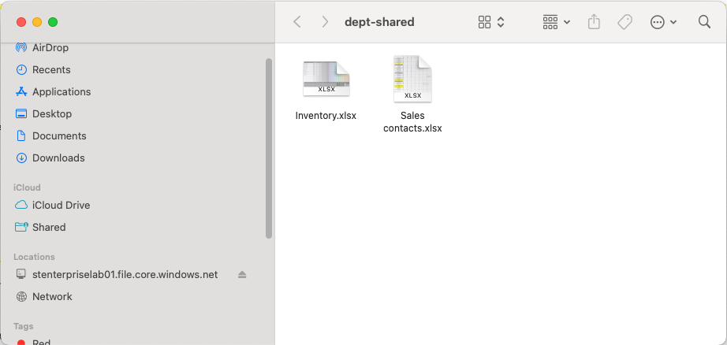
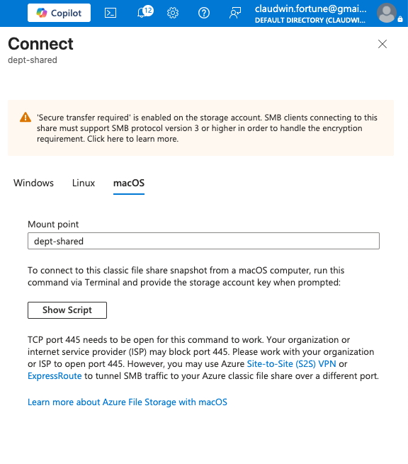
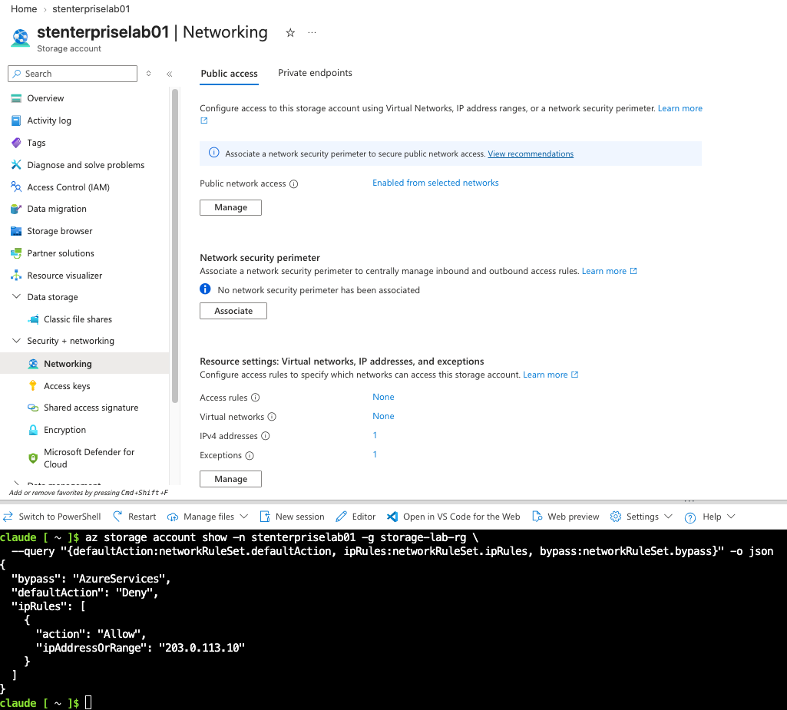
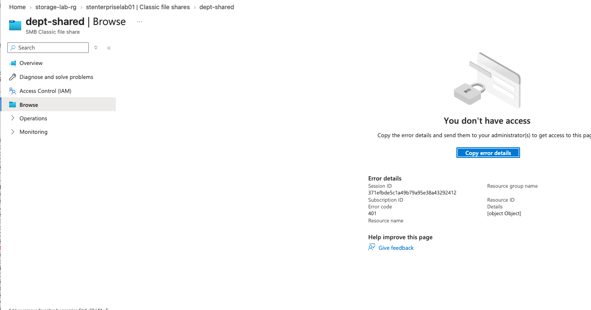
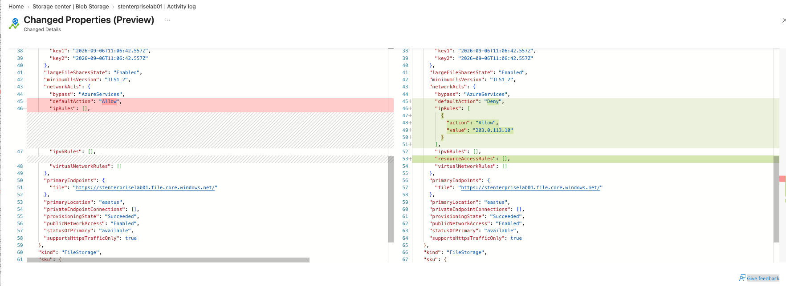
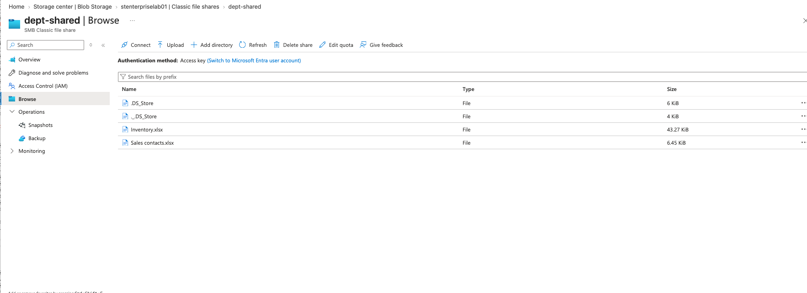

# TKT-005 — Azure File Mount Failure

| Field | Value |
|-------|-------|
| **User** | John Wayne |
| **Priority** | Medium |
| **Category** | Network |
| **Opened** |  10:28 am |
| **Resolved** | 11:56 am |
| **Time to resolve** | 1 hr 20 MINS |
| **SLA met** | Yes (target: 1h first response / 4h resolution) |

---

## Symptom

User reported that they were unable to access the shared folder in azure and access needed files. 
They were able to access the files yerterday but not today.

## Diagnosis
Worked the layers in order, cheapest and broadest first.

**Authorization — eliminated.** The portal error pointed at permissions, so
role assignments were checked first and found unchanged. The account has no
identity-based authentication configured (`azureFilesIdentityBasedAuthentication:
null`), so share-level RBAC and NTFS ACLs are not in play at all.

**Network reachability — eliminated.** `nc -zvw5 <account>.file.core.windows.net 445`
completed a TCP handshake. DNS resolved, the port was open, transport was
fine. The rejection was happening above the transport layer, at the service.

Client public IP was `74.106.16.106` — not in the allow list. Confirmed in
the Activity log: an `Update Storage Account` operation had changed the
network rules earlier that morning.

## Resolution
1. Added the client's public IP to the storage account firewall allow list
2. Left `defaultAction: Deny` in place — did not revert to open access
3. Waited ~60 seconds for propagation
4. Verified all three paths restored: CLI file list, portal Storage browser,
   SMB remount

## Cause / Fix / Prevention
**Cause:** The storage account firewall was set to denied-by-default with an
allow list that did not include the users' network. Traffic was rejected at
the service before authentication or authorization were evaluated.

**Fix:** Added the legitimate client IP rather than reopening the account to
all networks. The restriction appeared deliberate; removing it would have
undone a security control to fix an omission in it.

**Prevention:**
- Allow-listing a single dynamic IP is fragile — an ISP reassignment breaks
  this again with no change made by anyone
- Durable alternatives are VNet service endpoints (allow a subnet) or private
  endpoints (private IP, no public exposure). Neither applies to a client on
  home internet, but both are the production answer
- The firewall is account-wide. Before switching `defaultAction` to Deny,
  enumerate every consumer of the account and confirm each appears in the
  allow list. Storage metrics show which client IPs were connecting before
  the change
- For any Azure Storage access failure, check `networkRuleSet` **before**
  auditing IAM. One command, and it eliminates the layer that produces the
  most misleading error

## Screenshots

**Baseline Firewall**

**Baseline Access Success**

**Baseline SMB Mount**

**Connection Blade**

**Firewall Restriction**

**Storage Browser 401 No Access**

**Diagnosis Activity Log**

**Storage Browser Access Success**

