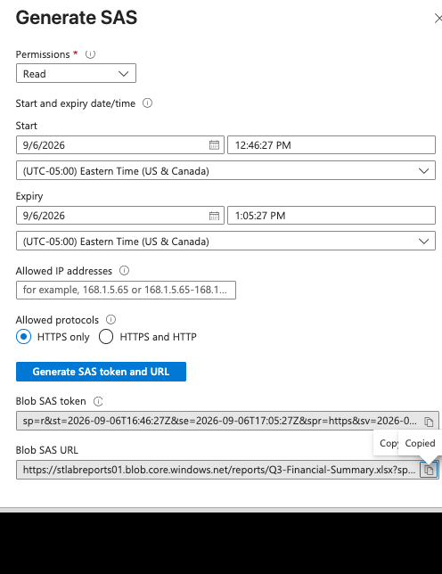

# TKT-006 — Azure File Mount Failure

| Field | Value |
|-------|-------|
| **User** | John Wayne |
| **Priority** | Medium |
| **Category** | Network |
| **Opened** |  10:28 am |
| **Resolved** | 11:56 am |
| **Time to resolve** | 1 hr 20 MINS |
| **SLA met** | Yes (target: 1h first response / 4h resolution) |

---

## Symptom

User reported that a link to a shared report returned an access denied
error. The link had worked when it was first sent. No other users affected;
no changes made to the file or the storage account.

## Diagnosis

Reproduced the failure with `curl -i` against the original URL. The response
body named the cause directly:

- Status: `403`
- `x-ms-error-code`: `AuthenticationFailed`
- `AuthenticationErrorDetail`: signature not valid in the specified time
  frame, with start, expiry, and current server time

The SAS token had been issued with a short expiry window that had since
lapsed. No misconfiguration and no change record — the Activity log showed
nothing, because nothing was changed.

## Resolution
1. Generated a replacement read-only SAS on the same blob with a 7-day expiry
2. Verified `200 OK` via `curl -I`
3. Confirmed same `ETag` — the blob itself was unchanged

## Cause / Fix / Prevention
**Cause:** SAS expiry elapsed. Expiry is signed into the token, so the
credential became invalid at a fixed point in time with no action by anyone.

**Prevention**

**Prevention:** A SAS with an embedded expiry cannot be extended or revoked
individually — the only lever is rotating the account key, which invalidates
every token signed with it. Stored access policies hold the expiry and
permissions on the container instead, referenced by `si=`, so a link can be
extended or revoked server-side. Demonstrated below. Also: `sig` is a
credential and should be redacted anywhere a link is pasted or screenshotted.

## Screenshots

**Generated a replacement read-only SAS**

**SAS token with a short expiry lapsed**

**SAS token access policy works**

